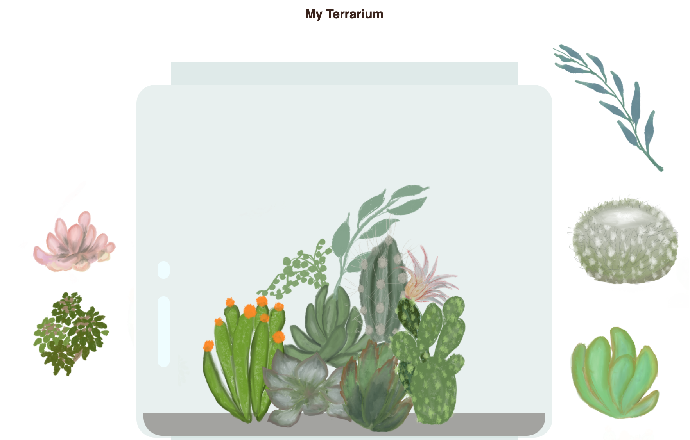

# My Terrarium: A project to learn about HTML, CSS, and DOM manipulation using JavaScript 🌵🌱

A small drag and drop code-meditation. With a little HTML, JS and CSS, you can build a web interface, style it, and add an interaction.

## Questions on HTML

1. ### ✅ What would happen if you set a viewport meta tag like this: `<meta name="viewport" content="width=600">`? 
1. ### Why an `` tag does not need a closing tag?
1. ### what would happen if you transformed `
` into ``?
1. ### What examples are mentioned in the terrarium instructions of the need to provide an alt attribute for an image?
1. ### Each image in the provided code has the same alt attribute. Is it a good practice?
1. ### when you add the following markup nothing is rendered in the web page, why?

<pre>
&lt;div id="terrarium">
  &lt;div class="jar-top">&lt;/div>
  &lt;div class="jar-walls">
    &lt;div class="jar-glossy-long">&lt;/div>
    &lt;div class="jar-glossy-short">&lt;/div>
  &lt;/div>
  &lt;div class="dirt">&lt;/div>
  &lt;div class="jar-bottom">&lt;/div>
&lt;/div>
</pre>

## Questions on CSS

1. ### what does the term `cascade` in CSS mean?
1. ### How do you understand the term **inheritance** in the context of styling an HTML page?
1. ### Can you make a nested style inherit a different property?
1. ### in the `plant-holder` class the height was set to 13%, why?
1. ### did you do?: ✅ Experiment with switching the types of positioning of the side containers and the plant-holder. What happens?
1. ### ✅ Why do you need both a plant holder and a plant CSS selector?
1. ### ✅ Did you experiment with switching the types of positioning of the side containers and the plant-holder. What did happen?
1. ### did you do?: ✅ Try changing the jar colors and opacity vs. those of the dirt. What happens? Why?

## Questions on JavaScript

1. ### why the DOM might be represented as a tree?
1. ### when importing an external JavaScript script, what does the term `defer` is referring to?
1. ### Why do we reference elements by Id? why not by their CSS class?
1. ### What is a closure?
1. ### what is a `pointerdown` event? how do you use it?
1. ### Why you would not use the `click` event instead of the `pointerdown` event for the same purpose?
1. ### Did you try to render the terrarium witout `e.preventDefault()` line? What did happen?
1. ### Did you try to dig into the event `e`? Did you try `console.dir(e)`?
1. ### What can you tell about the `e` event?
1. ### after you selected a plant, you could drag it over the screen, briefly describe how does it affect the values of pos1, pos2, pos3, pos4 variables in the code. 
1. ### Did you try using `Drag and Drop API`? Could you achieve the same result? briefly explain.